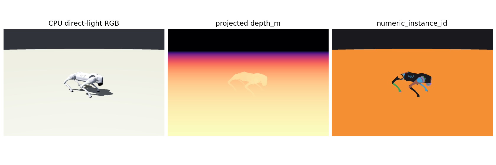
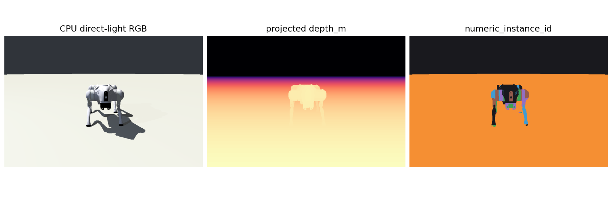

# Robot Simulator

**Robot Simulator** *(working title)* is a physics simulation platform for embodied intelligence research, built on four principles:

- **Multi-physics from the ground up** — rigid bodies, deformables, and fluids under a unified coupling architecture, designed to scale across physics domains
- **GPU-native** — algorithms and data structures designed for massively parallel execution, targeting large-scale simulation for reinforcement learning and beyond
- **Rendering and synthetic data** — a rendering pipeline that produces high-quality visual output with full physical annotation, not just debug visualization
- **First-principles API design** — every interface boundary and material parameter traces back to a physical concept; engineering convenience is never a reason to obscure the underlying physics

## Status

| Phase | Description | Status |
|-------|-------------|--------|
| 1 | CPU physics core — ABA, penalty contact, joint limits, AABB self-collision | ✅ Complete |
| 2 | GPU acceleration — NVIDIA Warp physics backends and parallel VecEnv | 🔄 In progress |
| 3 | Rendering and sensing — backend-agnostic render scenes, sensor readings, optical registry/executors | ✅ Complete |
| 4 | Optical Pipeline Lab — GPU optical BVH/direct-light/raygen, physics-published frames, static asset builders | 🔄 In progress |
| 5 | Domain randomization, deformable/fluid subsystems, sim-to-real tooling | ⬜ Planned |

## Optical rendering preview

The optical pipeline can render RGB, metric depth, and numeric instance segmentation from the same scene query. The preview below uses the Unitree Go2 visual mesh from Google DeepMind's MuJoCo Menagerie, imported into the in-repo optical registry and rendered with the CPU BVH/direct-light reference executor.

Current optical lab work extends that foundation with GPU device-scene executors, BVH traversal, direct lighting and shadow rays, CUDA LBVH rebuilds, GPU pinhole ray generation, and a source-driven render foundation. The production-facing dynamic path starts from physics-published frames. Static asset builders are only for non-simulated assets: they construct optical registries, camera presets, and preview assets, then feed the same generic render session, workspace, frame preparation, and video-loop helpers under `tools/optical_pipeline_lab/`.





The Go2 assets are not vendored in this repository. They were loaded from a local checkout of `google-deepmind/mujoco_menagerie`; consult the model directory's BSD-3-Clause `LICENSE` before redistributing those assets.

## Running tests

| Scope | Command |
|-------|---------|
| Commit gate (~2 min) | `python -m pytest tests/ -m "not (slow or gpu)"` |
| Optical lab focused | `PYTHONPATH=. pytest tests/unit/optics -q` |
| Sensing/optics collection | `PYTHONPATH=. pytest --collect-only -q tests/unit/optics tests/unit/sensing tests/gpu/test_optical_warp_executor.py tests/gpu/test_optical_gpu_runtime.py` |
| Including GPU | `python -m pytest tests/ -m "not slow"` |
| Full suite (~21 min) | `python -m pytest tests/ -v` |

## Extras

| Extra | Installs | When needed |
|-------|----------|-------------|
| `dev` | pytest, scipy, pillow, trimesh, gymnasium, torch | development and testing |
| `mesh` | trimesh | mesh loading (runtime) |
| `rl` | gymnasium, torch | RL environment (runtime) |
| `rerun` | rerun-sdk>=0.16 | Rerun visualisation backend |

```bash
pip install -e ".[dev,rerun]"
```

## GPU environment

Warp (NVIDIA) must be installed manually — the correct version depends on your local CUDA driver:

```bash
pip install warp-lang  # match to your CUDA version
python -m pytest tests/ -m "not slow" -v
```

See the [Warp repository](https://github.com/NVIDIA/warp) for the CUDA compatibility matrix.
